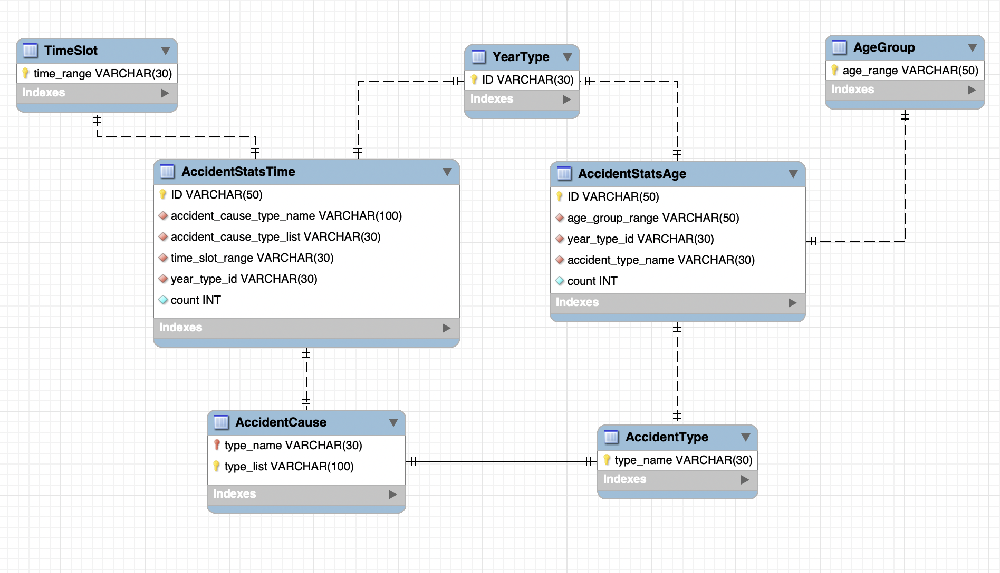

# SKN13-1st-1Team

# ❗성동일 조

# 🚦 교통사고 통계 및 FAQ 대시보드 프로젝트

---

## 👨‍👩‍👧‍👦 1. 팀원 및 담당 업무

| 이름     | 역할                        |
|----------|-----------------------------|
| 고범석   | 팀장 / 크롤링 및 데이터베이스 |
| 구자현   | 크롤링 및 데이터베이스        |
| 기원준   | 크롤링 및 데이터베이스        |
| 홍채우   | 스트림릿 전송 및 표현          |
| 정호엽   | 스트림릿 전송 및 표현          |

---

## 🎯 2. 프로젝트 주제 및 설명

**주제명:**  
**연령대-사고유형별 시간대별 교통사고 통계 및 FAQ 서비스**

**주제 선정 이유:**  
차량 운전자 수가 증가함에 따라 교통사고 발생 건수도 함께 증가하고 있습니다.  
본 프로젝트는 사고 발생 시간대, 사고유형, 운전자 연령대를 함께 시각화함으로써 교통사고의 주요 원인과 시간대를 파악하여 사고 예방에 도움을 주기 위함입니다.

---

## 📁 3. 프로젝트 디렉토리 구조

| 디렉토리 / 파일 | 설명 |
|------------------|------|
| `data/` | 데이터 파일 폴더 |
| ├── `create_tables.sql` | DB 테이블 생성 스크립트 |
| └── `sample_data.csv` | 테스트용 샘플 데이터 |
| `db/` | DB 연결 관련 폴더 |
| └── `connection.py` | MySQL DB 연결 함수 |
| `pages/` | Streamlit 페이지 모듈 폴더 |
| ├── `1_연령대별_사고통계.py` | 연령대별 사고 통계 시각화 |
| ├── `2_사고유형별_사고통계.py` | 사고유형별 시간대 통계 |
| └── `3_FAQ_그래프연동.py` | FAQ 기반 그래프 페이지 |
| `images/` | 이미지 및 ERD 저장 |
| └── `TAAS.jpg` | 프로젝트 관련 이미지 |
| `utils/` | 유틸리티 함수 폴더 |
| └── `helpers.py` | 공통 데이터 처리 함수 |
| `.gitignore` | Git 무시 파일 목록 |
| `requirements.txt` | 설치할 패키지 목록 |
| `README.md` | 프로젝트 설명 문서 |
| `streamlit_app.py` | Streamlit 메인 앱 (홈페이지) |

---

## 📊 4. 수집 데이터 설명

**출처:**  
TAAS 교통사고분석시스템 (https://taas.koroad.or.kr)

**데이터 범위:**  
2014년부터 2023년까지의  
- 연령대별 시간대 사고 건수  
- 사고유형별 시간대 사고 건수, 부상자 수, 사망자 수  

---

## 🧮 5. 데이터베이스 테이블 구조

### 주요 통계 테이블

| 테이블명             | 설명 |
|----------------------|------|
| `AccidentStatsAge`   | 연령별 사고유형 교통사고 통계 저장 (사고수 등) |
| `AccidentStatsTime`  | 시간대별 사고유형 교통사고 통계 저장 (사고수 등) |

### 참조 테이블

| 테이블명         | 설명 |
|------------------|------|
| `AgeGroup`       | 연령대 정보 (예: '21~30세') |
| `TimeSlot`       | 시간대 정보 (예: '00~02시') |
| `YearType`       | 연도 정보 (예: 2023) |
| `AccidentCause`  | 구체적 사고유형 ('차대사람-횡단중') |
| `AccidentType`   | 사고유형 그룹 (예: 차대사람, 차대차 등) |

### 테이블 관계 다이어그램 (ERD)

---

## 💡 6. 주요 기능

- 원하는 **연도 선택** 기능
- **연령대별 / 사고유형별 시간대 통계** 그래프 시각화
- **사고 건수 / 부상자 수 / 사망자 수** 비교
- **체크박스**를 통한 필터링
- **FAQ 기반 시각화** 기능 제공 (예: "20대는 언제 가장 많이 사고가 나는가?")

예시 화면:

<!--  -->

---

## 🔧 7. 사용 패키지

  
  
  
  
  
  

  
  
  
  
  
  
  

---

## 🔁 8. 회고

### 8-1. 문제 및 해결 과정

- 크롤링 시 iframe 내 테이블 접근이 어려웠으나, `switch_to.frame()`을 통해 해결  
- 사고유형 분류 시, 대분류-중분류-소분류를 구분하여 정규화된 DB 설계 필요  

### 8-2. 느낀 점

- 실무에서 필요한 DB 정규화와 관계 설정의 중요성 체감  
- Streamlit을 통한 실시간 시각화의 장점 이해  
- 데이터 기반으로 사고 위험 요소를 파악할 수 있는 유의미한 분석 경험

---

## 📸 추가 이미지 예시 (옵션)

- 시각화 예시:  
  <!--  -->

- FAQ 동작 예시:  
  <!--  -->

---

## 🔗 출처

- TAAS 교통사고분석시스템: https://taas.koroad.or.kr

